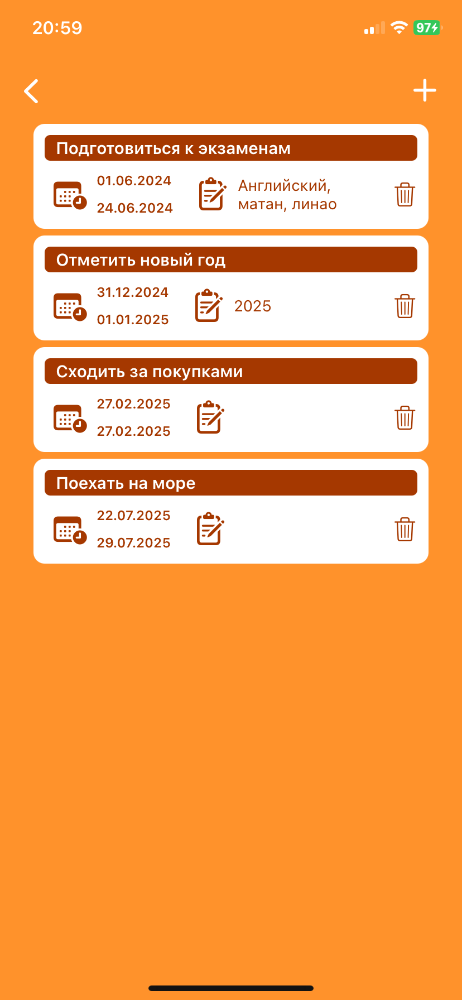
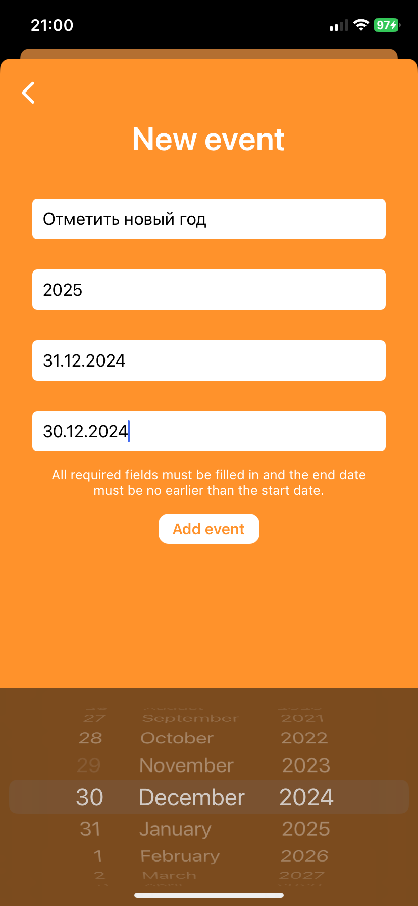

WishMaker
=
Описание
-

WishMaker – мобильное приложение на Swift (UIKit, Xcode) с архитектурой VIP и Core Data для хранения данных.

* WishMakerViewController – кастомные слайдеры для изменения цвета фона.
* WishStoringViewController – ввод, сохранение и удаление записей в UICollectionView.
* WishCalendarViewController – отображение событий пользователя в кастомных ячейках.
* WishEventCreationViewController – создание и добавление новых событий в календарь.

Функционал
-
Основной экран - **WishMaker** - содержит стек кастомных слайдеров для изменения фона экрана, кнопку "Add wishes"
для перехода к WishStoring, кнопку "Schedule wishes granting" для перехода к WishEvent.


Экран **WishStoring** содержит поле для создания записей и коллекцию пользовательских записей.
Пользователь может добавлять и удалять записи, осуществляется сортировка записей - новые записи отображаются сверху.


Экран **WishCalendar** содержит коллекцию пользовательских событий. События при добавлении сортируются по дате начала от 
старых к новым сверху вниз. Также экран содержит кнопку "+" для перехода к экрану WishEventCreation.


Экран **WishEventCreation** содержит текстовые поля и кнопку "Add event" для создания и добавления новых
пользовательских событий. При добавлении события осуществляется проверка на то, что название события введено и что 
дата окончания события не раньше даты начала. 





Установка и использование проекта
-
### Требования
- macOS с установленным Xcode (версия 15.0 или новее)
- Swift и UIKit

### Установка
1. **Клонируйте репозиторий или скачайте по кнопке <>Code -> DownloadZIP**  
   ```sh
   git clone https://github.com/pshen0/WishMaker.git
    ```
2. **Перейдите в нужную папку**
    ```sh
    cd path/WishMaker
    ```
3. **Откройте проект в Xcode**
    ```sh
    open WishMaker.xcodeproj
    ```
4. **Соберите и запустите проект в Xcode**
Выберите симулятор или подключенное устройство
Нажмите Cmd + R или Run в Xcode
